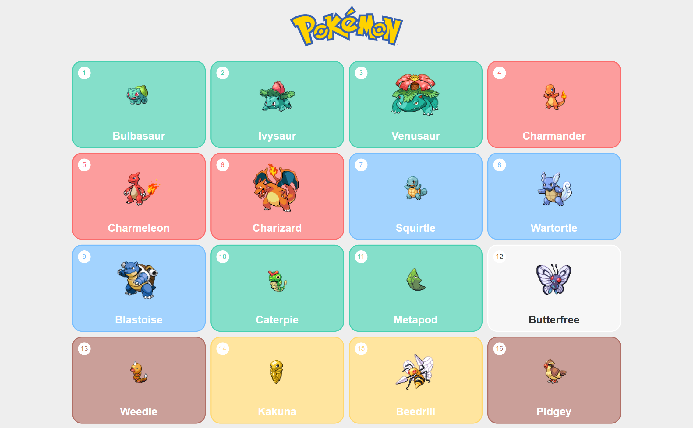
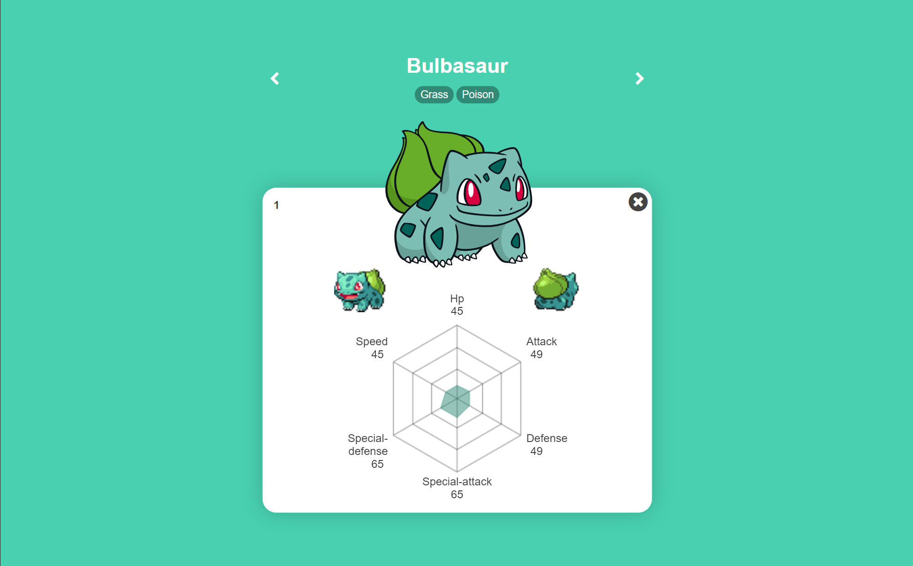
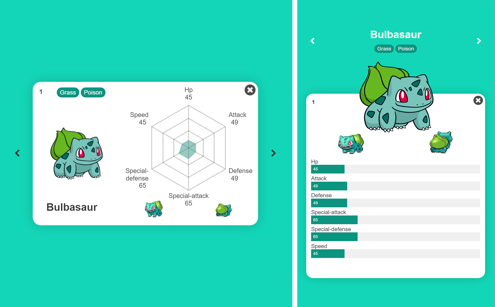

# Pokedex

&nbsp;&nbsp;
&nbsp;&nbsp;
&nbsp;&nbsp;
&nbsp;&nbsp;
&nbsp;&nbsp;

## [Repositorio](https://github.com/luisangelsalcedo/pokedex) &nbsp;&nbsp;|&nbsp;&nbsp; [Deploy](https://luisangelsalcedo.github.io/pokedex/) &nbsp;&nbsp;|&nbsp;&nbsp; [API](https://pokeapi.co/api/v2/pokemon)

 

